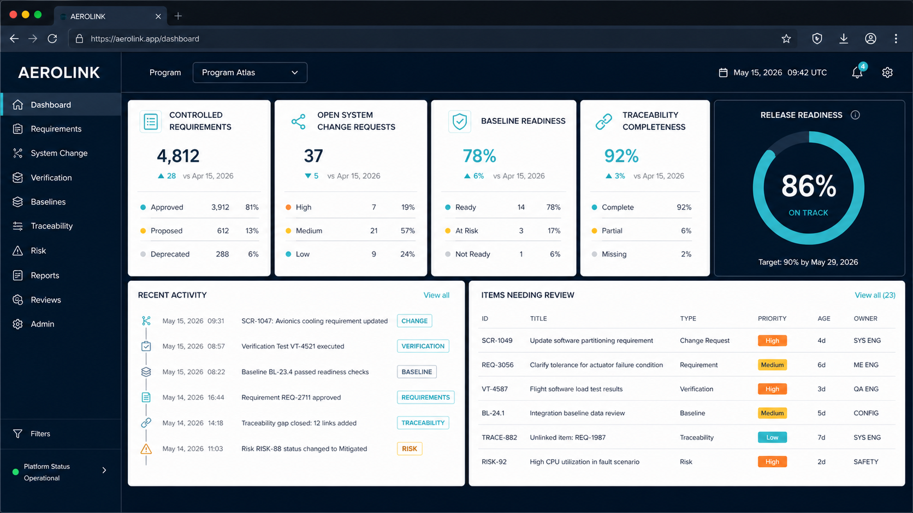
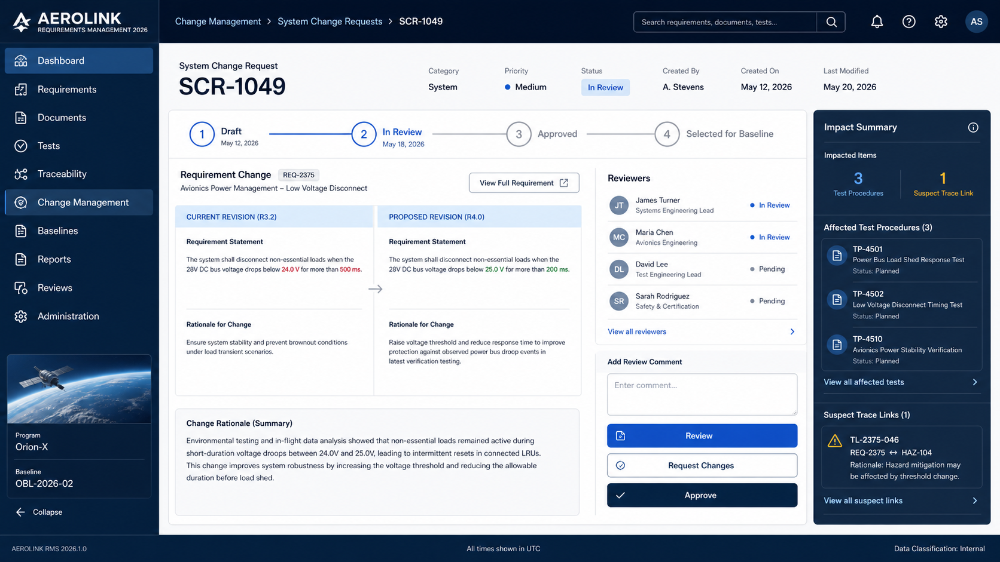
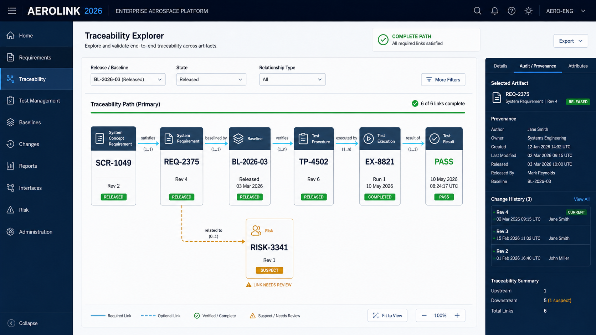
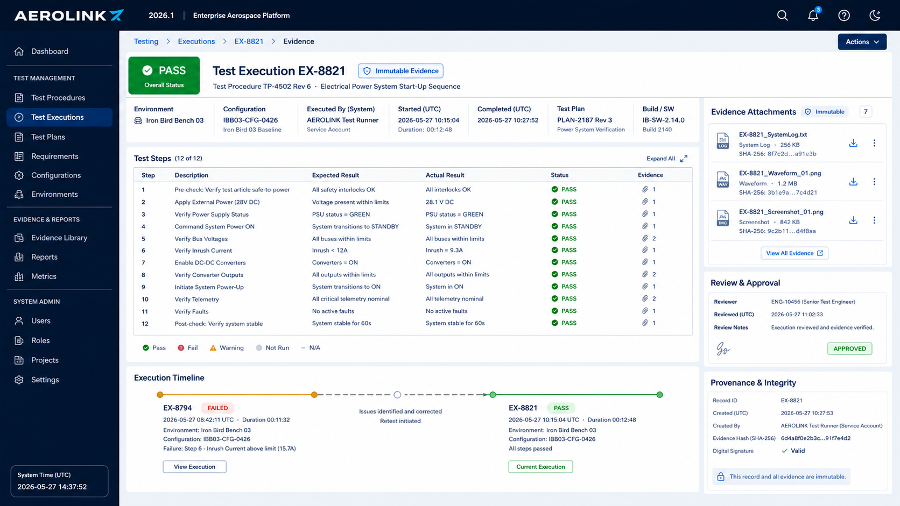

# Design Vision and Dashboards

This document turns the AeroLink concept mockups into guiding product direction. The images are inspiration, not approved implementation specifications. Future design work may refine layout, naming, metrics, and visual treatment while preserving the behaviors and principles defined here.

> **Current implementation note — 2026-08-01.** The active Command Center is intentionally a simpler
> three-way System/Software/Verification view, reached only after Project and Software Build selection.
> Requirement totals, Release Attention and Change Request Flow are not current dashboard requirements.
> Problem Reports are active through their dedicated build-scoped center; Product Versions and Candidate
> Baselines remain dormant UI. Treat the mockups below as inspiration, not instructions to restore retired
> dashboard elements. See
> [CURRENT_PRODUCT_HANDOFF_2026-08-01.md](CURRENT_PRODUCT_HANDOFF_2026-08-01.md).

## Experience Vision

The product should feel like calm mission control for controlled lifecycle data:

- **Clear before clever:** hierarchy, state, ownership, revision, and next action are immediately understandable.
- **Dense but not cramped:** expert users can see meaningful context without losing readability or navigation.
- **Trustworthy by design:** every summary exposes its definition, source, applicable baseline or release, freshness, and drill-down path.
- **Role-aware, not role-fragmented:** managers and engineers see different priorities while working from the same controlled records.
- **Action-oriented:** dashboards identify what needs attention and provide direct navigation to the responsible artifacts or workflow.
- **Accessible:** strong contrast, visible keyboard focus, generous interaction targets, alternatives to color-only meaning, and predictable navigation are baseline expectations.
- **Serious rather than futuristic:** restrained navy, white, slate, cyan, green, and amber communicate control without decorative “sci-fi” effects.

## Reference Mockups

### Portfolio and Release Dashboard

This is the primary north-star dashboard. It combines release readiness, controlled-requirement status, open SCRs, traceability completeness, baseline readiness, recent activity, and items needing review.

### SCR Review and Impact Analysis

This screen demonstrates the intended relationship among revision comparison, review workflow, named reviewers, affected tests, suspect links, and approval actions.

### Interactive Traceability Explorer

This screen demonstrates traceability as a navigable answer rather than only a static matrix. Users can inspect typed links, exact revisions, completion state, suspect relationships, and provenance in context.

### Immutable Test Evidence

This screen demonstrates test procedure/execution separation, configuration capture, evidence integrity, review, and a failure-to-retest timeline that never erases the earlier result.

The complete manager-facing narrative is available in [the AeroLink concept deck](outputs/AeroLink_Manager_Concept_Deck.pptx).

## Dashboard Audiences

The first showcase and initial usable product prioritize **System Engineers** and **Managers**. Configuration/quality and administrator dashboards remain important supporting views but are secondary to proving those two primary experiences.

### Management Dashboard

Managers need concise program and release health with enough evidence to make decisions. The view should prioritize:

- release and baseline readiness;
- approval and review bottlenecks;
- requirement and verification completeness;
- outstanding failures, suspect links, and unresolved high-priority items;
- trends and changes since a meaningful prior point; and
- the owners and due actions behind every exception.

The management dashboard is not a substitute for engineering judgment. It summarizes controlled data and links directly to the evidence behind each status.

### Engineering Dashboard

Engineers need a personal, actionable work surface. The view should prioritize:

- assigned reviews and approval requests;
- draft or rework items owned by the user;
- recently changed upstream or downstream artifacts;
- suspect links requiring reassessment;
- requirements lacking complete verification;
- failed, blocked, or not-applicable test outcomes requiring disposition; and
- recent program activity relevant to the user’s role and assignments.

### Configuration and Quality Dashboard

Configuration-management and quality users need release-control and process evidence. The view should prioritize:

- candidate-baseline validation failures;
- approved items not yet selected, or selected items lacking required approval;
- unresolved review comments, the active approval stage, pending sequential approvers, cancelled/restarted cycles, and independence exceptions;
- document-generation jobs, provenance, and hashes;
- audit and administrative exceptions;
- withdrawn or superseded outputs; and
- backup, restore, and operational integrity signals appropriate to their role.

### Administrator Dashboard

Administrative views should focus on service operation, access, and policy configuration without presenting administrators as lifecycle-data approvers. Operational health and privileged actions remain visibly distinct from engineering approval authority.

## Trusted Metric Contract

Every dashboard metric must have a documented contract containing:

1. **Name and purpose:** What decision or action the metric supports.
2. **Definition:** Exact numerator, denominator, inclusion rules, exclusions, and status thresholds.
3. **Scope:** Program, product/system, configuration, release, baseline, artifact type, and time window.
4. **Source records:** The controlled artifacts, revisions, links, executions, or audit events used.
5. **Freshness:** When the value was computed and whether any source is stale, unavailable, or still processing.
6. **Owner:** The product or process owner responsible for approving the definition.
7. **Drill-down:** A direct path to the exact records contributing to the value and to excluded/problematic records.
8. **Authorization behavior:** Confirmation that a summary never reveals restricted counts, identifiers, or existence across access boundaries.
9. **Empty/error behavior:** Clear distinction among zero, no applicable data, insufficient permission, incomplete processing, and system error.
10. **Validation:** Known reference datasets and tests that prove the calculation.

No important readiness or compliance-looking score may be an unexplained weighted formula. If a composite score is ever used, its components, weights, thresholds, and limitations must be visible and approved.

## Initial Dashboard Measures

These are candidate measures for product validation; their formulas are not yet approved.

| Measure | Primary Audience | Intended Meaning | Required Drill-Down |
| --- | --- | --- | --- |
| Baseline readiness | Management, CM, quality | Whether a candidate baseline satisfies defined inclusion and control checks | Failed checks, affected artifacts, owners, and blocking rules |
| Traceability completeness | Management, engineering, quality | Whether applicable artifacts have required typed links | Missing, invalid, and suspect links by artifact and rule |
| Verification completeness | Management, verification | Whether applicable requirements have acceptable procedures and results | Requirements lacking procedures, acceptable executions, evidence, or review |
| Review demand | Management, engineering | Work awaiting review, approval, comment disposition, or rework | Exact assignments, age, priority, owner, and workflow state |
| Open SCRs | Management, engineering, CM | Change workload by target release and lifecycle state | SCRs, affected requirements, priority, age, owner, and blockers |
| Test outcome status | Management, verification, quality | Current evidence status without hiding prior failure history | All applicable executions, configurations, evidence, anomalies, and retests |
| Suspect-link exposure | Engineering, quality | Relationships requiring reassessment after change | Triggering change, affected links, review owner, age, and disposition |
| Document-generation status | CM, quality | State of draft and approved controlled output jobs | Source baseline, template, generator, job log, approval, and hash |

Before implementation, each candidate measure must be resolved through the Trusted Metric Contract and recorded as an approved product decision or metric specification.

## Interaction and Drill-Down Rules

- Selecting a status or count opens the exact filtered records that produced it.
- Filters remain visible and are reflected in page titles, URLs or shareable state, exports, and screenshots where practical.
- The current program, product/system, release, baseline, configuration, and time context are never implicit.
- Users can move from summary to artifact to revision, relationships, workflow, and audit without losing context.
- Status badges always include text or another non-color cue.
- Destructive or irreversible transitions are never performed directly from a summary tile without showing the exact target and consequence.
- Dashboard refresh must not silently replace a user’s active review context.
- Exported dashboard views identify scope, filters, generation time, and whether values are final or provisional.

## Visual and Accessibility Direction

- Use a restrained, high-contrast palette with consistent semantic colors.
- Prefer one stable primary navigation and predictable page anatomy.
- Use typography, spacing, alignment, and grouping before adding containers or decorative effects.
- Avoid tiny controls and color-only status indicators; support keyboard navigation and visible focus.
- Tables must support scanning, filtering, sorting, accessible names, and clear empty/error states.
- Graphs and trace views require list/table alternatives and keyboard-accessible navigation.
- Avoid animation that obscures status changes or becomes necessary to understand state.
- Design for common enterprise desktop resolutions first while preserving responsive access to essential workflows.

WCAG 2.2 is the initial accessibility reference. A future design system must define exact tokens, components, interaction states, content patterns, and test methods.

## Interactive Showcase — completed and retired

**Historical.** This section recorded the recommendation that produced the Phase 0.5 prototype. The
prototype was built, validated the information architecture and experience, fed its visual direction
into the product through the July 2026 usability refresh, and was retired on 2026-07-24 (DEC-046).

The visual system, dashboard direction and metric expectations in the rest of this document remain
authoritative for the product. The requirements below describe what the retired prototype had to do;
they are not outstanding work.

The showcase should:

- use representative fictional aerospace data;
- implement the visual system and navigation as a realistic desktop web experience;
- let a presenter move through one coherent story: dashboard -> SCR -> requirement revision -> impact -> baseline -> test evidence -> traceability;
- include management and engineering dashboard modes;
- demonstrate filters, drill-downs, state transitions, review comments, and evidence views;
- use simulated interactions and deterministic local data; and
- be clearly labeled as a concept, with no production, security, compliance, or data-integrity claims.

The showcase should not yet include:

- production authentication or authorization;
- a production database or migration strategy;
- real workflow enforcement or electronic approvals;
- controlled document generation;
- real integrations or test imports;
- persistent multi-user editing;
- production audit, backup, recovery, or deployment; or
- technology choices presented as irreversible architecture decisions.

### Showcase Acceptance Story

A presenter can:

1. open a manager dashboard and explain release readiness;
2. drill into a blocking SCR and compare the proposed requirement revision;
3. show affected tests and a suspect link;
4. demonstrate review and approval states without claiming a real signature;
5. inspect the candidate/released baseline context;
6. open a failed execution, its evidence, and the successful retest;
7. navigate the complete released trace chain and audit/provenance panel; and
8. return to a dashboard whose status visibly reflects the simulated story.

The purpose is to validate desirability, workflow comprehension, terminology, information architecture, and stakeholder alignment—not to prove technical feasibility or production readiness.

The canonical fictional scenario and presentation flow are defined in [SHOWCASE_STORY_FMS_3_3.md](SHOWCASE_STORY_FMS_3_3.md).
