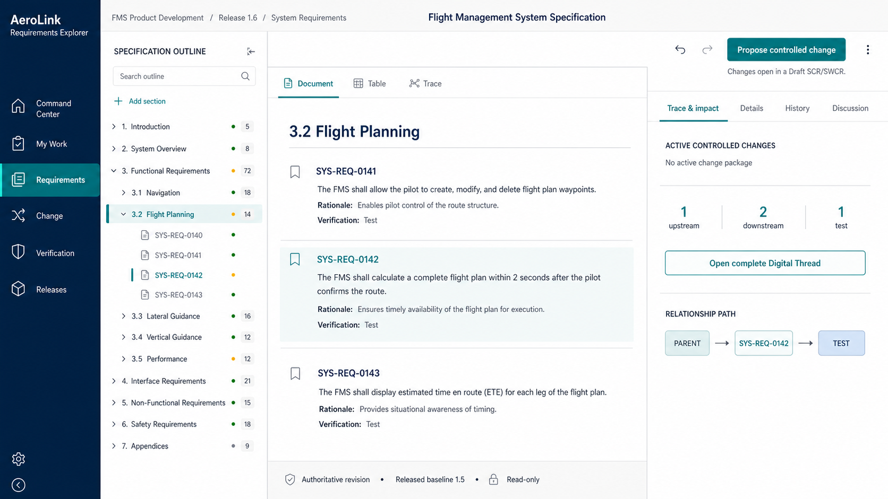

# Market-Informed UI Evolution Concepts

These mockups explore incremental AeroLink evolution rather than a wholesale redesign. They preserve the existing navy/teal identity, controlled-lifecycle language, and desktop-first enterprise layout.

Research snapshot: 2026-07-14.

Implementation status: all three concepts were accepted and implemented on 2026-07-14. Concept A now drives the live Requirements workspace, Concept B the Digital Thread relationship view, and Concept C the Release Readiness command surface. The mockups remain as the visual decision record rather than pixel-perfect production specifications.

## Products reviewed

- IBM Engineering Requirements Management DOORS Next
- Jama Connect
- Siemens Polarion REQUIREMENTS
- PTC Codebeamer
- Visure Requirements ALM
- Modern Requirements4DevOps
- Perforce ALM / Helix ALM
- ReqView as a focused document-authoring reference

## Patterns worth adapting

1. Keep the artifact structure, primary work, and selected-record context visible together.
2. Treat structured documents as first-class engineering workspaces, not file downloads.
3. Let relationship and impact views answer a specific engineering question.
4. Use role-aware defaults and progressive disclosure instead of displaying every field at once.
5. Present traceability, review, tests, risks, and release evidence as one connected product story.
6. Make the next accountable action visually dominant while retaining the evidence behind it.
7. Preserve dense expert workflows, but use spacing, hierarchy, typography, and inspectors to keep them calm.

## Patterns intentionally rejected

- crowded toolbar ribbons;
- tiny text and icons as the default density;
- dashboards made only from equally weighted KPI cards;
- permanent property panels that leave too little working space;
- status communicated only through color;
- decorative sci-fi effects that compete with controlled data; and
- copying any vendor's branding, component styling, or exact screen composition.

## Concepts

### Requirements Explorer — controlled viewing and trace context

This concept develops the implemented Precision Workbench into a calm,
authoritative Requirements Explorer: a resizable specification outline, a
spacious read-only document surface, and contextual trace, verification,
history, discussion, and active-change awareness. All content mutations move
to the dedicated Changes workspace and remain governed by Draft change request
authority.

Key proposal decisions:

- keep structure, authoritative content, and selected-requirement context visible together;
- make trace, verification, history, and active changes understandable without editing;
- hand “Propose controlled change” into a dedicated pre-populated change request route;
- keep the Explorer visibly read-only and remove bulk/import mutation entry points; and
- provide no AI-facing controls, scores, suggestions, or branding.

### A — Precision Workbench

A requirements workspace with specification structure, a large controlled-record surface, and a contextual inspector. This is the safest next evolution and the strongest improvement for daily authoring and review.

Decision prompts:

- Keep the three-pane anatomy?
- Use the dark contextual inspector header?
- Adopt saved views in the specification rail?

### B — Digital Thread Focus

An interactive relationship map centered on one engineering question, with a focused path and a plain-language evidence answer. This is the highest visual-impact showcase concept.

Decision prompts:

- Make this the primary traceability view or an optional map mode?
- Keep the question-and-answer inspector?
- Use restrained relationship animation when focus changes?

### C — Release Command

A release decision surface built around sequential gates, one next action, evidence freshness, and changes since the last review. This is the strongest manager-facing evolution.

Decision prompts:

- Replace the current readiness overview with this gate sequence?
- Keep a single confidence percentage or lead with remaining decisions only?
- Show the release package persistently on the right?

## Official product references

- <https://www.ibm.com/products/requirements-management>
- <https://www.jamasoftware.com/platform/jama-connect/>
- <https://www.siemens.com/en-us/products/polarion/requirements/>
- <https://www.ptc.com/en/products/codebeamer>
- <https://visuresolutions.com/tool-suite/requirements-alm-platform/>
- <https://www.modernrequirements.com/products/modern-requirements4devops/>
- <https://www.perforce.com/products/helix-requirements-management>
- <https://www.reqview.com/>
