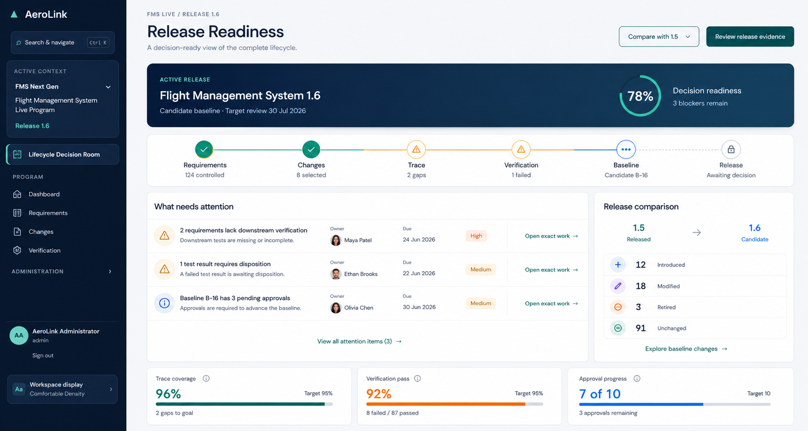
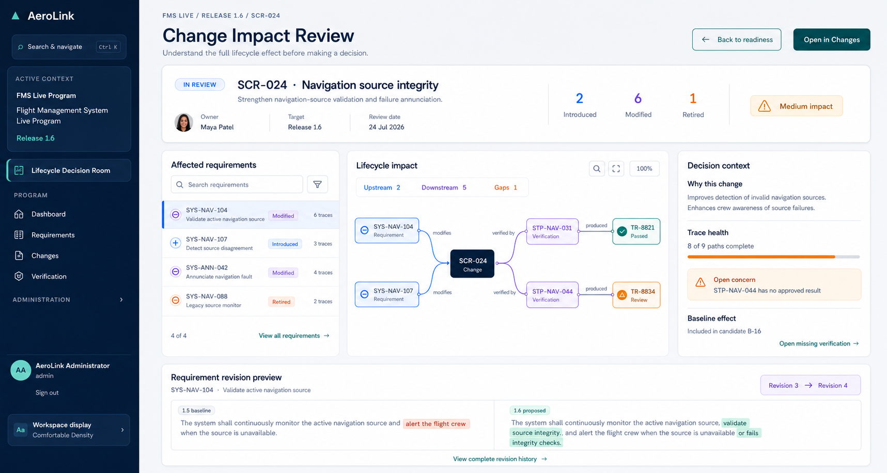
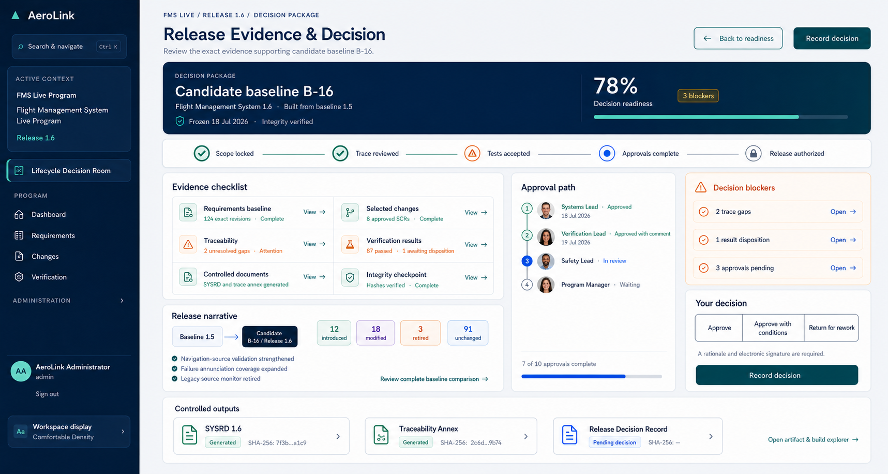

# Lifecycle Decision Room mockups

These concepts evolve the existing AeroLink design system into a connected release-decision journey for the Flight Management System Live Program.

## 1. Release Readiness

The release-level landing view establishes lifecycle status, blockers, baseline comparison, and evidence health without exposing unnecessary record detail.

## 2. Change Impact Review

The selected SCR is presented as a read-only impact story connecting affected requirements, verification, evidence, revision redlines, and the exact work needed to close gaps.

## 3. Release Evidence and Decision

The final decision package brings together exact baseline contents, selected changes, traceability, verification, approvals, integrity, controlled outputs, and the governed release decision.

## Product boundaries

- Requirements Explorer remains read-only.
- Requirement introductions, modifications, and retirements remain in SCR/SWCR workflows.
- The Decision Room summarizes authoritative records and deep-links to the correct work surface.
- No AI-facing controls, labels, scores, or suggestions are included.
- Progressive disclosure and legibility take priority over displaying every available field.
